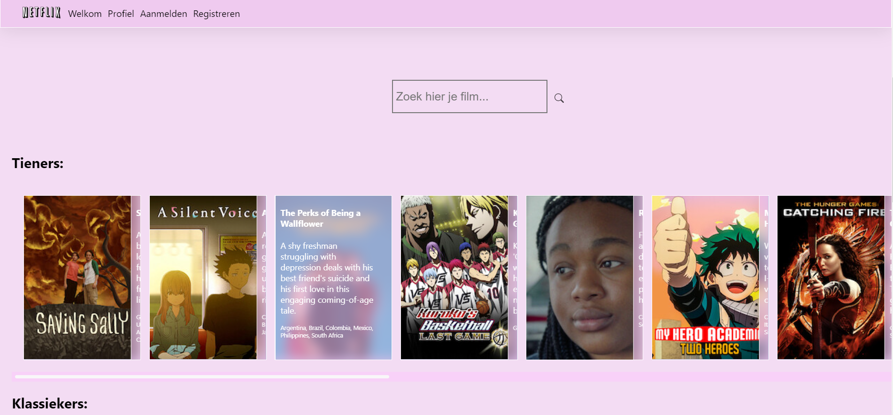
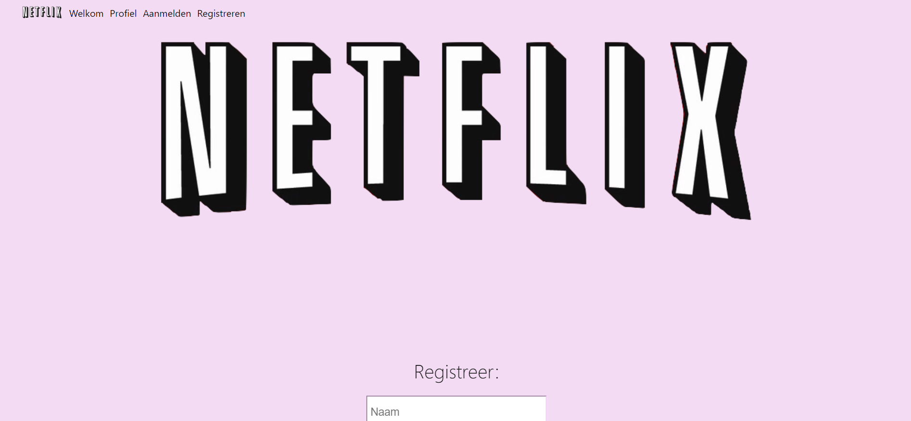
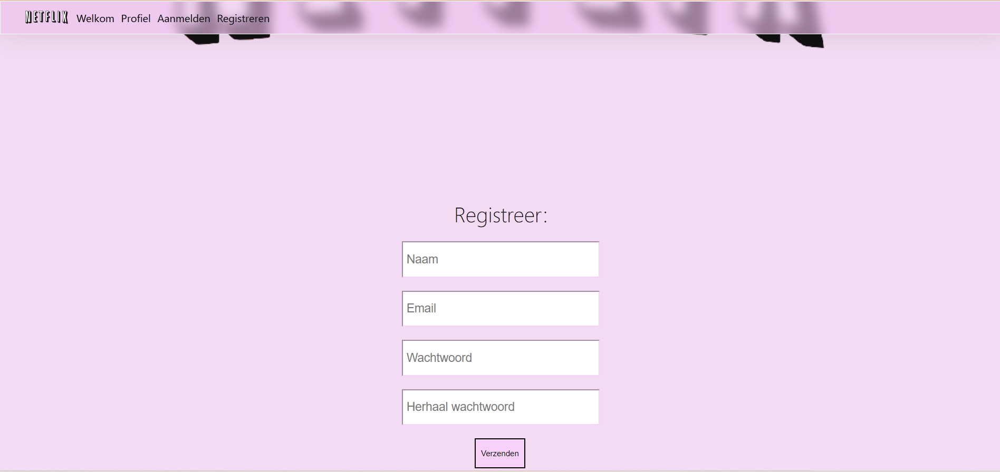
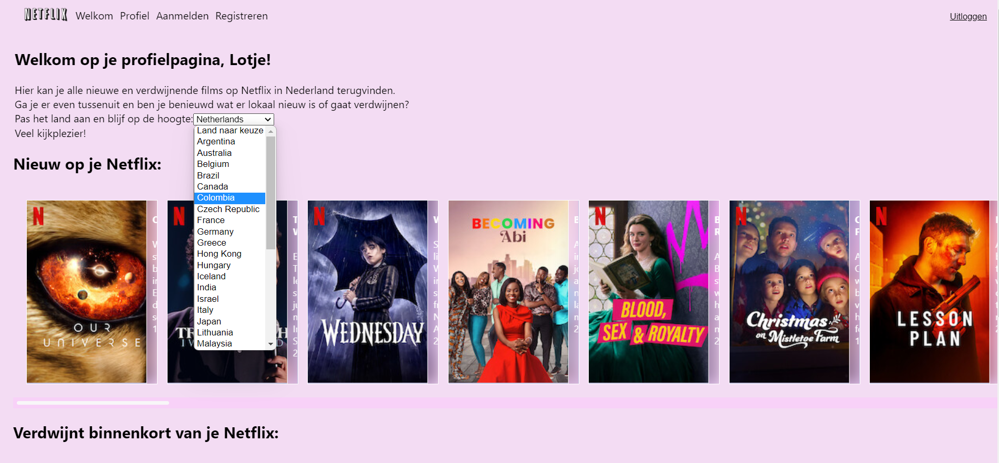
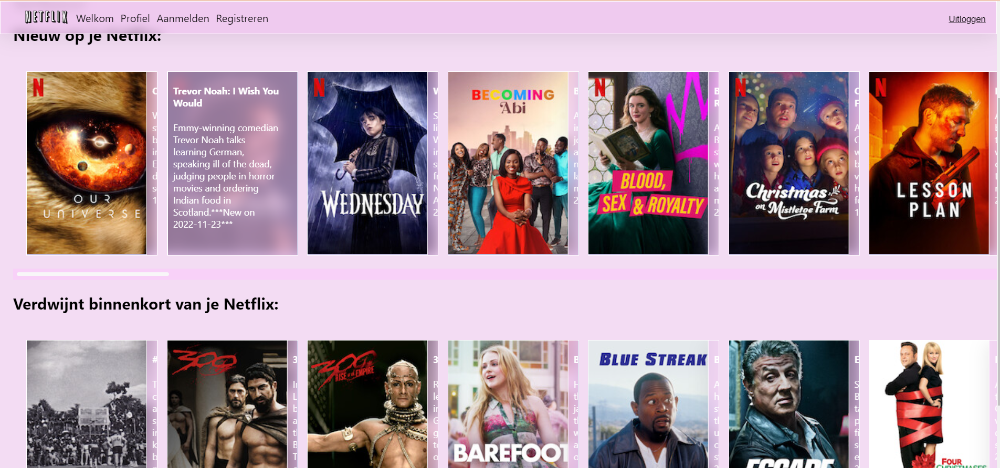

# Installatie van de NETFLIX-app

Deze repository bevat uitgewerkte code voor een applicatie gebaseerd op Netflix.
In de applicatie kan er naar films worden gezocht. 
De applicatie geeft  weer of de content beschikbaar is op Netflix en zo ja
,in welke landen. Ook kan je zien welke Nederlandse content er de komende 
maand van Netflix afgehaald zal worden en welke nieuwe content er verwacht wordt. 
Gebruikers kunnen registreren,
inloggen en een land naar keuze selecteren 
zodat de nieuwe- en verwijderde content op deze zelfgekozen locatie is toegespitst

https://github.com/TesseBogers/Netflix-platform

### Opstarten applicatie

In de project directory moet voor aanvang het volgende geinstalleerd worden:

- `npm install`
- Axios: `npm install axios`
- React-hook-form: `npm install react-hook-form`
- React-router-dom: `npm install react-router-dom@5`

Als aan deze voorwaarden voldaan is start je a.d.h.v. `npm start` te runnen in de IDE's terminal de applicatie in je browser.

